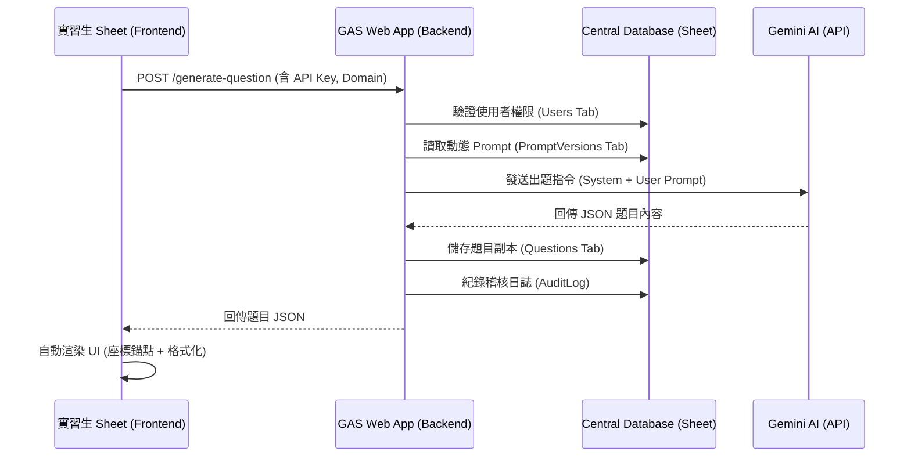
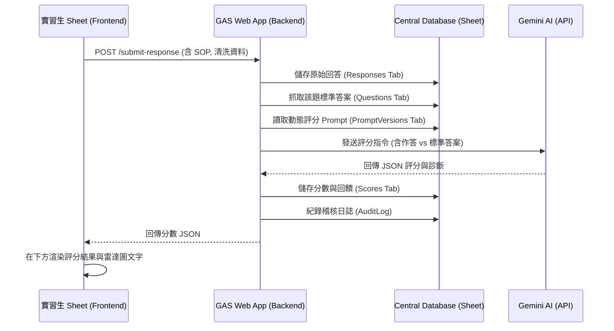

# 🏗️ 系統架構與流程 (System Architecture)

本文檔說明 **Data Judgment Training Platform** 的底層邏輯與資料流向。

---

## 🎨 系統流程圖

### 1. 題目生成流程 (Generation Flow)

---

### 2. 提交與評分流程 (Scoring Flow)

---

## 🛡️ 安全性決策
1.  **BYOK (Bring Your Own Key)**: 後端不儲存使用者的 API Key，由前端動態傳入，確保資安與成本自負。
2.  **Server-Side Master**: 題目生成後先由後端驗證 JSON 結構完整性才回傳，確保前端渲染必成功。
3.  **Audit Log**: 所有的 API 請求皆有存證，包含使用者 Email 與執行狀態，方便後續稽核與 Debug。
